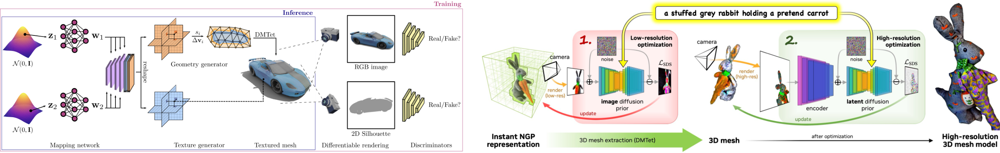

---
hide:
  - toc
---

# [Jun Gao](https://www.cs.toronto.edu/~jungao/){:target="_blank"}
## Revisiting representation, data and algorithm for scaling up 3D content generation
### Ph.D. Student at University of Toronto & Research Scientist at NVIDIA Toronto AI lab. Nov 22, 2023 (Wed), 10:30 a.m. KST Online (Zoom).

### <b>Guest Lecture at [CS479: Machine Learning for 3D Data](../){:target="_blank"} [Minhyuk Sung](http://mhsung.github.io/){:target="_blank"}, [KAIST](https://www.kaist.ac.kr/){:target="_blank"}, Fall 2023</b>

 
[Zoom Link](https://kaist.zoom.us/j/85920030773){:target="_blank" .md-button}

<a href="https://calendar.google.com/calendar/event?action=TEMPLATE&tmeid=Nm50Mmg1NjNyNGMwa2VyM2Yya3E0NGhiZTcgamhvMGR0bDBwczVjaWl2ZmxqOXJ0NmU0cWtAZw&tmsrc=jho0dtl0ps5ciivflj9rt6e4qk%40group.calendar.google.com" target="_blank" class="md-button">Google Calendar Link</a>

 
{ width=90% }  

### **Abstract**
Creating 3D virtual worlds will require generating diverse and high-quality 3D content that mimics the intricacies of the real 3D world. While machine learning has achieved significant success in image and video generation, its application in 3D content generation encounters fundamental challenges in the scarcity of 3D training data and increased complexities inherent in three dimensions. We approach the problem of 3D content generation by revisiting the representation, data and algorithms. First, we introduce a differentiable 3D representation that bridges neural fields with meshes via differentiable isosurfacing. This enables us not only to generate 3D meshes with varying topologies but also to regularize neural fields through the mesh. Second, we exploit 2D data prior to facilitating text-to-3D generation with a coarse-to-fine generation recipe. Specifically, we bring our differentiable isosurfacing to extract 3D meshes and differentiably render high-resolution images, which enables the generation of high-frequency details in geometry and textures from the text. Lastly, we develop a 3D generative algorithm that can generate high-quality meshes with textures by enforcing a 3D bottleneck in the generation process while supervising 2D images through differentiable rendering. I will also share some thoughts on the future direction of 3D content generation at the end of the talk.

### **Bio**
Jun Gao is a PhD student at the University of Toronto, advised by Prof. Sanja Fidler. He is also a Research Scientist at NVIDIA Toronto AI lab. His research interests focus on the intersection of 3D computer vision and computer graphics, particularly developing machine learning tools to facilitate large-scale and high-quality 3D content generation and drive real-world applications.

 

