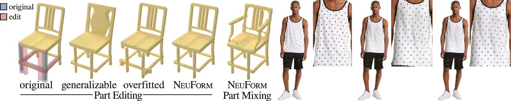

---
hide:
  - toc
---

# [Niloy J. Mitra](http://www0.cs.ucl.ac.uk/staff/n.mitra/){:target="_blank"}
## Learning to Model Geometric Deformation from Limited Data 
### Professor at UCL & Director at Adobe Research London Office Oct 10, 2023 (Tue), 4:00 p.m. KST E3-1, Rm 1101.

### <b>Guest Lecture at [CS479: Machine Learning for 3D Data](../){:target="_blank"} [Minhyuk Sung](http://mhsung.github.io/){:target="_blank"}, [KAIST](https://www.kaist.ac.kr/){:target="_blank"}, Fall 2023</b>

 
<a href="https://calendar.google.com/calendar/event?action=TEMPLATE&tmeid=NXNqYXI4MnI2ZGluaGdwaGdjZzQzdHB1cnAgamhvMGR0bDBwczVjaWl2ZmxqOXJ0NmU0cWtAZw&tmsrc=jho0dtl0ps5ciivflj9rt6e4qk%40group.calendar.google.com" target="_blank" class="md-button">Google Calendar Link</a>

 
{ width=90% }  

### **Abstract**
Parameterized shape space is essential for many downstream tasks. To achieve this, we need to address three subproblems: establishing correspondence across different shapes, building an underlying deformation model, and discovering a lower-dimensional parameterization of the 'templatized' shapes. Although hundreds of papers have investigated this problem over many decades, the subproblems have primarily been addressed separately. We propose a new approach that employs deep learning tools to simultaneously solve all three tasks. Our current findings indicate that, armed with suitable geometric energies, it is possible to tackle this problem in an unsupervised setup, with access to a limited amount of 3D data. Furthermore, we have extended our method to learn geometric motions directly from data without rigging or skinning information.

### **Bio**
Niloy J. Mitra leads the Smart Geometry Processing group in the Department of Computer Science at University College London and the Adobe Research London Lab. He received his Ph.D. from Stanford University under the guidance of Leonidas Guibas. His research focuses on developing machine learning frameworks for generative models for high-quality geometric and appearance content for CG applications. Niloy's technical contributions in the field of computer graphics have earned him numerous prestigious awards. He was awarded the Eurographics Outstanding Technical Contributions Award in 2019, the British Computer Society Roger Needham Award in 2015, and the ACM SIGGRAPH Significant New Researcher Award in 2013. Furthermore, he was elected as a fellow of Eurographics in 2021 and served as the Technical Papers Chair for SIGGRAPH in 2022. His work has also earned him a place in the SIGGRAPH Academy in 2023. Besides research, Niloy is an active DIYer and loves reading, cricket, and cooking. More information: <a href="https://geometry.cs.ucl.ac.uk" target="_blank">geometry.cs.ucl.ac.uk</a>.

 

